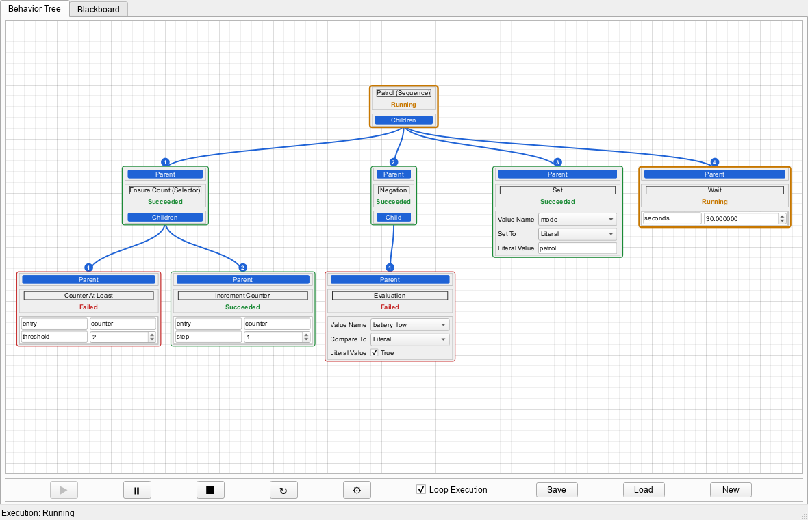

# behavior-tree-widget

A PySide6 widget for **building and executing [py_trees](https://py-trees.readthedocs.io/en/devel/)
behavior trees graphically**. Drop the `BehaviorTreeWidget` into your Qt application and write
your own leaf nodes in Python. Users can then draw the tree, edit node fields, run it with
py_trees, and inspect or modify the blackboard.



* **Behavior Tree tab**: a pannable, zoomable canvas with a Root node, Sequence, Selector and
  Negation nodes, the built-in Evaluation and Set blackboard nodes, and your custom leaf nodes.
  You draw connections with the mouse, select nodes, and copy and paste them.
* **Blackboard tab**: named Integer, Double, String, Bool, List, Dictionary and Set entries that
  nodes read and write (`GetEntry` / `SetEntry`).
* **Execution**: Execute, Pause, Stop, Reset and Configure buttons and a Loop Execution check
  box. Every node shows *Ready*, *Running*, *Succeeded* or *Failed*. Execution uses
  `py_trees.composites.Sequence` / `Selector`, `py_trees.decorators.Inverter` and a
  `py_trees.trees.BehaviourTree`, ticked by a Qt timer.
* **Files**: New, Save and Load trees as `.json`, including node positions, fields and
  blackboard values.

---

## Contents

1. [Installation](#installation)
2. [Quick start](#quick-start)
3. [Writing leaf nodes](#writing-leaf-nodes)
4. [Built-in nodes](#built-in-nodes)
5. [The blackboard](#the-blackboard)
6. [Using the editor](#using-the-editor)
7. [Execution semantics](#execution-semantics)
8. [Tree files](#tree-files)
9. [API reference](#api-reference)
10. [Threading rules](#threading-rules)
11. [Building, testing and project layout](#building-testing-and-project-layout)
12. [Notes and design decisions](#notes-and-design-decisions)

---

## Installation

Requirements: Python ≥ 3.10, PySide6 ≥ 6.5 and py_trees ≥ 2.2.1. pip installs these
automatically.

```bash
pip install behavior_tree_widget-0.2.0-py3-none-any.whl
```

The wheel is in the `dist/` folder of this repository. See
[Building](#building-testing-and-project-layout) to create it yourself.

To use the widget in another project, install the wheel into that project's environment. To
declare it as a dependency, point to the wheel file or to a folder of wheels:

```text
# requirements.txt
behavior-tree-widget @ file:///C:/path/to/behavior_tree_widget-0.2.0-py3-none-any.whl
```

```toml
# pyproject.toml of your project
[project]
dependencies = ["behavior-tree-widget>=0.2"]
# install with:  pip install --find-links C:/path/to/wheels -e .
```

Then `import behavior_tree_widget` (see [Quick start](#quick-start)).

Try the bundled demo, which registers a few example nodes:

```bash
behavior-tree-widget-demo               # GUI launcher (no console window on Windows)
python -m behavior_tree_widget          # same, but shows the demo's log output in the console
python -m behavior_tree_widget my_tree.json   # open a tree directly
```

## Quick start

```python
import sys
from PySide6.QtWidgets import QApplication, QMainWindow
from behavior_tree_widget import BehaviorTreeWidget, LeafNodeWidget


class SayHello(LeafNodeWidget):
    _title = "Say Hello"                      # text of the node's Title label
    _fields = {"name": "world", "times": 1}   # editable fields shown on the node

    def OnRun(self, tree):
        for _ in range(self.GetField("times")):
            print(f"Hello {self.GetField('name')}!")
        tree.SetEntry(self.GetField("name"), "greeted")   # write the blackboard
        return True                                        # True = Succeeded, False = Failed


class MainWindow(QMainWindow):
    def __init__(self):
        super().__init__()
        self.tree = BehaviorTreeWidget(node_types=[SayHello])
        self.setCentralWidget(self.tree)

    def closeEvent(self, event):
        if not self.tree.ConfirmDiscardChanges():   # offers to save unsaved changes
            event.ignore()
            return
        self.tree.Shutdown()                         # stops execution, releases the blackboard
        super().closeEvent(event)


app = QApplication(sys.argv)
window = MainWindow()
window.show()
sys.exit(app.exec())
```

To use it:

1. Click **New** to create a tree file. The editor stays disabled until a tree is created or
   loaded.
2. Right-click the canvas to add nodes.
3. Drag from a node's **Children** label to another node's **Parent** label to connect them, or
   release the line on empty canvas to add a new node connected to it.
4. Click **Execute**.

A fuller example, which also builds a tree from code, is in
[`examples/custom_app.py`](examples/custom_app.py).

## Writing leaf nodes

Leaf nodes contain your application logic. Subclass `LeafNodeWidget`, override `OnRun` and
register the class with the widget.

```python
import time
from behavior_tree_widget import LeafNodeWidget, Status


class MoveTo(LeafNodeWidget):
    _title = "Move To"
    _fields = {
        "x": 0.0,                          # float -> QDoubleSpinBox
        "y": 0.0,
        "speed": 5,                        # int   -> QSpinBox
        "mode": ["walk", "run"],           # list  -> QComboBox (user picks one item)
        "avoid_obstacles": True,           # bool  -> QCheckBox
        "label": "target",                 # str   -> QLineEdit
    }

    def OnRun(self, tree):
        mode = self.GetFieldSelection("mode")          # item selected in the combo box
        for _ in range(100):
            if self.CancelRequested():                 # Stop / Reset was pressed
                return False
            time.sleep(0.01)
        tree.SetEntry([self.GetField("x"), self.GetField("y")], "position")
        return True
```

### Class attributes

| Attribute | Meaning |
|---|---|
| `_title` | Default title shown in the node's Title label. Defaults to the class name. Users can rename individual nodes (right-click → Rename…). |
| `_fields` | Dict of field name → default value. Supported types: `int` (a 32-bit spin box), `float` (a spin box with `FLOAT_DECIMALS`, default 6, decimals), `str`, `bool` and `list`. Values of other types are shown read-only. Each node gets its own deep copy of the dict. Fields are shown on the node and saved with the tree. A node without fields hides its fields frame. |
| `RUN_IN_THREAD` | `True` (default): `OnRun` runs on a worker thread, so long operations do not freeze the UI. `False`: `OnRun` runs on the GUI thread; use this for quick checks, or when `OnRun` touches Qt widgets. |
| `THREAD_WAIT` | Seconds (default `0.02`) the tick waits for a worker-thread `OnRun` call it has just started, so quick calls finish within one tick. With `0` the node always shows *Running* first. |
| `TYPE_NAME` | Name used in saved files and for registration. Defaults to the class name and is not inherited by subclasses. It must be unique and must not be a built-in type name: `Root`, `Sequence`, `Selector`, `Negation`, `Evaluation` or `Set`. |
| `UI_FILE` | Optional custom Qt Designer file for the node: an absolute path, or a path relative to the module that defines the class. It must contain the named widgets `Title`, `Status` and `ParentConnection`, and may contain `FrameFields` + `Fields` (QListView). |

You can also assign `_title` and `_fields` in your class's `__init__`, before or after calling
`super().__init__()`, and the node shows the assigned values. At run time use `SetTitle` and
`SetField`.

### Methods you override

| Method | When it is called |
|---|---|
| `OnRun(self, tree)` **(required)** | Called when the node is ticked and none of its calls is in progress. With `RUN_IN_THREAD = False`, that is once per tick while the node runs. With `RUN_IN_THREAD = True`, it is called once on a worker thread; the node shows *Running* while later ticks wait for it. `tree` is the `BehaviorTreeWidget`. You may also declare `OnRun(self)` and use `self.GetTree()`. Return `True` / `Status.SUCCESS` (Succeeded), `False` / `Status.FAILURE` (Failed), or `Status.RUNNING` (not finished; `OnRun` is called again on the next tick). Raising an exception, or returning anything else (for example, forgetting `return`), makes the node fail. The error is logged and shown in the Status label's tooltip. |
| `OnStart(self, tree)` | Called on the GUI thread each time the node starts running, before its first `OnRun`. |
| `OnTerminate(self, tree, status)` | Called on the GUI thread once, when the node stops running. `status` is `NodeStatus.SUCCEEDED` or `FAILED` when it finished, or `NodeStatus.READY` when it was interrupted (Stop, Reset, preempted by its parent, or loading another tree). |

`OnStart` and `OnTerminate` must accept the `tree` argument; only `OnRun` may omit it.

With `RUN_IN_THREAD = True`, a node still in `OnRun` shows *Running*, the tree keeps ticking
and the UI stays responsive. A running call cannot be killed, so when the node is interrupted:

* `self.CancelRequested()` becomes `True` for that call. Check it regularly in long loops and
  return early. The result of an interrupted call is ignored.
* The call can no longer change the tree. `tree.SetEntry`, `self.SetField`, `self.SetTitle`,
  assigning `self._title` / `self._fields`, and the execution commands raise
  `behavior_tree_widget.ExecutionCancelled`.
* A node never runs two `OnRun` calls at once. If the node is started again while its
  interrupted call is still returning, it shows *Running* and waits for that call first.

### Thread-safe helpers available inside `OnRun`

| Call | Purpose |
|---|---|
| `tree.GetEntry(name)` / `tree.SetEntry(value, name)` | Read or write the blackboard. |
| `tree.HasEntry(name)` | Check whether an entry exists. |
| `tree.Stop()`, `tree.Reset()`, `tree.Execute()`, `tree.Pause()` | Control execution; carried out on the GUI thread. |
| `self.GetField(key)` / `self.SetField(key, value)` | Read or change a field; the editor updates on the GUI thread. |
| `self.GetFieldSelection(key)` / `GetFieldSelectionIndex(key)` | Selected item / index of a list field. The list in `_fields` stays the list of choices. |
| `self.CancelRequested()` | `True` once the running call should stop early. |
| `self.GetTitle()` / `self.SetTitle(text)` | Node title. |

In worker-thread nodes, do **not** touch Qt widgets directly; use the calls above.

### Registering node types

```python
from behavior_tree_widget import BehaviorTreeWidget, LeafNodeWidget, register_node_type


class Beep(LeafNodeWidget):
    def OnRun(self, tree):
        return True


widget = BehaviorTreeWidget(node_types=[Beep])   # when creating the widget ...
widget.RegisterNodeType(Beep)                     # ... or later (registering again is allowed)


@register_node_type        # alternative: every BehaviorTreeWidget created AFTER this is offered Buzz
class Buzz(LeafNodeWidget):
    def OnRun(self, tree):
        return True
```

Registered types appear in the canvas right-click menu, and are needed to load trees that use
them. If a tree uses a node type that is not registered, loading it creates a placeholder node
marked "(unknown type)". The placeholder keeps all of the node's saved data and fails when
executed, so saving the tree again loses nothing.

## Built-in nodes

Besides the Root, Sequence and Selector, every `BehaviorTreeWidget` offers three built-in node
types in its right-click menu. They need no registration.

### Negation

A node with a **Parent** label and a single **Child** label that inverts the result of its child
(`py_trees.decorators.Inverter`):

| Child | Negation |
|---|---|
| *Succeeded* | *Failed* |
| *Failed* | *Succeeded* |
| *Running* | *Running* |

A Negation has one child. Connecting another child replaces the current one, just as connecting
a node that already has a parent replaces its old parent. A Negation without a child fails when
it is executed, and its Status tooltip says why.

### Evaluation and Set

Leaf nodes that check or change blackboard values without any code. Both show three editors:

| Editor | Purpose |
|---|---|
| **Value Name** (combo box `ValueName`) | The blackboard entry the node works on. Lists every entry of the blackboard. |
| **Compare To** (Evaluation) / **Set To** (Set) (combo box `CompareTo`) | *Literal*, or another entry of the same type as the Value Name entry. |
| **Literal Value** (`LiteralValue`) | Shown and enabled only while *Literal* is chosen. Its editor follows the type of the Value Name entry: a spin box for Integer, a double spin box for Double, a line edit for String, a check box for Bool, and a line edit taking a Python literal (`[1, 2]`, `{'a': 1}`, `{1, 2}`) for List, Dictionary and Set. |

* **Evaluation** succeeds when the Value Name entry equals the Compare To entry (or the literal)
  and fails otherwise. Values are compared with `==`, except that a Bool never equals a number.
* **Set** sets the Value Name entry to the value of the Set To entry (or to the literal) and
  succeeds.
* Both run on the GUI thread (`RUN_IN_THREAD = False`). They fail with an error (Status tooltip,
  `nodeError` signal) when no entry is chosen or when an entry they need does not exist.
* The combo boxes follow the blackboard: new entries appear, and renamed entries are followed.
  A chosen entry that disappears stays chosen and is shown in red as "(missing)", so removing and
  re-adding an entry, or loading a tree, loses nothing.
* Choosing a Value Name of another type resets Compare To to *Literal* and converts the literal
  where possible (for example, an Integer literal `5` becomes `5.0` for a Double entry and `"5"`
  for a String entry).
* The choices are the node's fields and are saved with the tree: `ValueName` (`""` until an entry
  is chosen), `CompareTo` (an entry name, or `null` for *Literal*) and `LiteralValue`. The
  literal is used with the type of the Value Name entry.

From code:

```python
check = widget.AddNode("Evaluation", 0, 200)
check.SetValueName("battery_low")   # the entry to evaluate
check.SetCompareTo(None)            # None = Literal; or the name of another entry
check.SetLiteralValue(True)

setter = widget.AddNode("Set", 300, 200)
setter.SetValueName("mode")
setter.SetLiteralValue("patrol")
```

## The blackboard

The **Blackboard** tab lists named entries that nodes share:

* **Add an entry:** choose a type in the combo box and click **Add Entry**. A dialog asks for
  the name and the initial value.
* **Remove entries:** tick entries (or **Select All**) and click **Remove Entries**.
* **Edit an entry:** names and values can be edited in place. List, Dictionary and Set values
  are edited with their **Edit…** button, as a Python literal such as `[1, 2.5, 'text']` or
  `{'key': 3}`; `nan` and `inf` are accepted.

| Type | Python type | Editor |
|---|---|---|
| Integer | `int` (32-bit) | spin box |
| Double | `float` | double spin box showing the exact value (also `nan`, `inf`); type `inf` / `-inf` for infinity, `,` is accepted as decimal point |
| String | `str` | line edit |
| Bool | `bool` | check box |
| List | `list` | combo box listing `str()` of each item |
| Dictionary | `dict` | combo box listing `key: value` |
| Set | `set` | combo box |
| Object | anything else | read-only text; only created from code, never saved |

From code (see [Threading rules](#threading-rules)):

```python
widget.SetEntry(3, "counter")          # creates an Integer entry (type inferred) or updates it
widget.GetEntry("counter")             # -> 3   (KeyError if it does not exist)
widget.AddEntry("speed", "Double", 1.5)
widget.HasEntry("speed"), widget.GetEntryNames(), widget.GetEntryType("speed")
widget.RemoveEntry("speed")
```

* `SetEntry(value, name)` creates missing entries, inferring the type:
  * `bool` → Bool
  * `int` within ±2³¹ → Integer; larger ints → Object
  * `float` → Double, `str` → String
  * `list`/`tuple` → List (stored as a list), `dict` → Dictionary, `set`/`frozenset` → Set
  * anything else, including `None` → Object
  * A new list/dict/set holding objects that cannot be copied (locks, devices, …) → Object.
* `AddEntry(name, type_name, value=None)` accepts these type names, case-insensitive:
  Integer/Int, Double/Float, String/Str, Bool/Boolean, List, Dictionary/Dict, Set, Object.
  If `value` is None, the entry gets the type's default value.
* `SetEntry` on an existing entry needs a compatible value: an `int` (not a `bool`) or an
  integral `float` for Integer, an `int` or `float` (not `bool`) for Double, and so on.
  Otherwise it raises `TypeError` / `ValueError`.
* `GetEntry` returns copies of List/Dictionary/Set values; call `SetEntry` to publish changes.
* Entry names must be non-empty, must not start or end with spaces, and cannot contain `.` or
  `/`.
* **Object entries are run-time values.** Use them for things like device handles: they are
  never written to tree files and are kept when a tree is created or loaded.
* Each entry is stored in the py_trees blackboard under the key
  `widget.GetBlackboardNamespace() + "/" + name`, for example
  `/behavior_tree_widget_79daae42568b/counter`. Plain py_trees code can read it with
  `py_trees.blackboard.Blackboard.get(key)` or a Client with READ access. Write through
  `SetEntry`, so values are validated and shown in the tab.

## Using the editor

| Action | How |
|---|---|
| Add a node | Right-click empty canvas and choose Sequence, Selector, Negation, Evaluation, Set or one of your leaf types. The node is placed at the click position. |
| Add a connected node | Drag from a **Children** or **Parent** label and release over empty canvas (or a line). The Add Node menu opens there, as for a right click. The node you choose is placed where you released and connected to the label you dragged from: below a Children label, or above a Parent label (replacing an old parent). A node that cannot be connected that way, such as a leaf as a parent, is added unconnected. Closing the menu adds nothing. |
| Delete / rename a node | Right-click the node → Delete / Rename…. The Root cannot be deleted. |
| Change a composite | Right-click a Sequence, Selector or the Root → Sequence or Selector, and Memory on/off. |
| Connect | Press on a **Children** label and drag to another node's **Parent** label, or the other way round. While you drag, the line is red, and turns green over a compatible label. Release there to connect; the line turns blue. Releasing over a node cancels; releasing over empty canvas opens the Add Node menu (see above). Connecting a node that already has a parent replaces its old connection, and so does connecting a second child to a Negation. Cycles are not allowed. |
| Select / delete a connection | Click the line; it turns green. Press **Delete** (or Backspace) to delete it. Clicking anywhere else deselects it. Right-click a line → Delete Connection also works. |
| Select nodes | Click a node; selected nodes have a blue outline. **Ctrl + click** adds or removes a node, **Shift + click** adds one. **Ctrl or Shift + drag** on empty canvas selects every node the rectangle touches. **Ctrl+A** selects all nodes. Click empty canvas (without dragging) or press **Esc** to deselect. |
| Move nodes | Drag a node anywhere except its Parent/Children labels and input fields; dragging on a field's name works. Dragging a selected node moves every selected node. |
| Copy and paste nodes | Select nodes, press **Ctrl+C**, then **Ctrl+V**. The copies are placed in the free area nearest to the original nodes, at least 20 pixels from every other node, keeping their arrangement and the connections between them. They become the selection, and the view scrolls to show them if needed. Each Ctrl+V pastes another set. The Root is never copied, and connections to nodes that were not copied are not copied. While an input field of a node has the keyboard, Ctrl+C / Ctrl+V / Ctrl+A act on its text instead. Copied nodes can be pasted into another BehaviorTreeWidget, also in another application; node types it does not know become placeholders. |
| Pan | Drag empty canvas or a connection line, or drag with the middle mouse button anywhere. Panning keeps the selection. |
| Zoom | Ctrl + mouse wheel. |
| Edit fields | Use the editors on leaf nodes; changes take effect immediately. |

Connection label colours:
* **red**: not connected
* **green**: a connection is being placed
* **blue**: connected

The numbers on connection lines show the execution order of a composite's children. The order
is **left to right** as drawn (for ties, the higher node comes first); move nodes to reorder.
While a tree executes, the numbers keep showing the order the running tree uses; moving nodes
changes the order at the next Execute.
If a Sequence, Selector, Negation or Root node's title differs from its type, the type is shown
in brackets, for example "Root (Sequence)".

While a tree is executing (running or paused), its structure is locked:
* Nodes and connections cannot be added or removed, and Ctrl+V pastes nothing.
* The composite type, Memory and Delete menu items, and the Delete key, are disabled.
* `AddNode`, `RemoveNode`, `Connect`, `Disconnect`, `PasteNodes`, `NodeWidget.SetParent`,
  `AddChild` and `RemoveChild` raise `RuntimeError`.

You can still select, copy, move and rename nodes, and edit fields and the blackboard.
`SetCompositeType` / `SetMemory` called from code take effect at the next Execute.

## Execution semantics

| Button | Effect |
|---|---|
| Execute ▶ | Builds a py_trees tree from the nodes connected to the Root and starts ticking it. Resumes when paused. |
| Pause ⏸ | Stops ticking. A worker-thread `OnRun` already in progress continues. |
| Stop ⏹ | Stops ticking, interrupts running nodes (`CancelRequested()` becomes true, `OnTerminate(…, READY)`), and resets every node to *Ready*. |
| Reset 🔄 | Resets every node to *Ready* without halting; a running tree starts over on its next tick. |
| Configure ⚙ | Opens the options dialog (below). |
| Loop Execution ☐ | Unchecked (the default): execution stops when the Root returns (succeeds or fails). Checked: each time the Root returns, the tree is executed again, starting on the next tick (the tick interval is the only pause). |

* **Loop Execution** keeps everything as it was when the Root returned: blackboard entries,
  node fields and any other state of your nodes carry over into the next loop, as if execution
  never paused. Only the Status labels go back to *Ready* at the start of each loop, so they show
  the progress of the current loop. "Restore blackboard values on Stop / Reset" still applies
  only to Stop and Reset. `executionFinished` is not emitted while looping. The check box can be
  switched while the tree runs: unchecking it lets the current loop finish and then stops;
  checking it keeps a running tree going. It is the same option as Configure → Execution
  (`TreeConfig.repeat`, `GetLoopExecution()` / `SetLoopExecution()`) and is saved with the tree.
* A **Sequence** runs its children left to right until one fails, and a **Selector** until one
  succeeds (`py_trees.composites.Sequence` / `Selector`). The Root is a Sequence by default;
  switch it to a Selector from its right-click menu.
* A **Negation** succeeds when its child fails and fails when its child succeeds
  (`py_trees.decorators.Inverter`); see [Built-in nodes](#built-in-nodes).
* **Memory** is on by default, and can be set per composite from the right-click menu. With
  memory, a composite resumes from its running child on the next tick instead of re-evaluating
  earlier children every tick (py_trees `memory=True`). With memory off, earlier children are
  re-run every tick, so they should be quick conditions.
* Status labels:
  * *Ready*: not run yet
  * *Running*
  * *Succeeded*
  * *Failed*

  A node keeps showing its last result until the tree is reset or executed again. Nodes that
  are not connected to the Root are ignored.
* Values written by running nodes (blackboard entries, fields, titles) do not count as unsaved
  changes, but they are part of the tree: a later Save writes them. Enable "Restore blackboard
  values on Stop / Reset" to undo blackboard changes. Changes your code makes on the GUI thread
  while the tree is idle, such as a `SetEntry` at start-up, count as edits.
* Execute, Pause, Stop and Reset called during a tick (from `OnRun`, a signal handler or a
  dialog) are carried out right after that tick. After a Stop or Reset, no more node code runs
  in that tick. Commands issued while another command is being carried out are queued.

Configure options (saved with the tree):

| Option | Default | Meaning |
|---|---|---|
| Tick interval | 100 ms | Time between ticks (1–60000 ms). |
| Execution | Run once | *Run once* stops when the Root succeeds or fails; *Loop* executes the tree again each time. The same option as the Loop Execution check box. |
| Restore blackboard values on Stop / Reset | off | Takes a snapshot of the blackboard when execution starts and restores it on Stop, or on Reset (also after a completed run). Blackboard edits you make while the tree is idle discard the snapshot. |
| New Sequence / Selector nodes use memory | on | Default memory flag for new composites. |

## Tree files

* **New** asks for a file name and creates a tree that contains only the Root, with default
  options.
* **Save** writes the current tree to a file you choose.
* **Load** opens a tree file.

After New, Load or Save, the widget sets the title of its top-level window (`widget.window()`)
to `Behavior Tree - <file name>`. To change the text, set
`BehaviorTreeWidget.WINDOW_TITLE_FORMAT`. The buttons ask you to save unsaved changes before
New or Load replace the tree. The methods called with a path (`NewTree(path)`, `LoadTree(path)`)
do not ask. Use `if widget.ConfirmDiscardChanges(): widget.LoadTree(path)` for the same
behaviour.

A tree file is JSON:

```json
{
  "format": "behavior_tree_widget",
  "version": 1,
  "config": {"tick_interval_ms": 100, "repeat": false, "restore_blackboard": false, "default_memory": true},
  "view": {"zoom": 1.0, "center": [0.0, 200.0]},
  "nodes": [
    {"id": "4f0c…", "type": "Root", "title": "Root", "x": 0.0, "y": 0.0, "composite": "Sequence", "memory": true},
    {"id": "9a1d…", "type": "MoveTo", "title": "Move To", "x": -40.0, "y": 180.0,
     "fields": {"x": 1.5, "y": 0.0, "speed": 5, "mode": ["walk", "run"], "avoid_obstacles": true, "label": "target"},
     "field_selections": {"mode": 1}},
    {"id": "77b2…", "type": "Negation", "title": "Negation", "x": 300.0, "y": 180.0},
    {"id": "e1c4…", "type": "Evaluation", "title": "Evaluation", "x": 260.0, "y": 340.0,
     "fields": {"ValueName": "counter", "CompareTo": null, "LiteralValue": 3}}
  ],
  "connections": [
    {"parent": "4f0c…", "child": "9a1d…"},
    {"parent": "4f0c…", "child": "77b2…"},
    {"parent": "77b2…", "child": "e1c4…"}
  ],
  "blackboard": [{"name": "counter", "type": "Integer", "value": 3}]
}
```

`config.repeat` is the Loop Execution check box.

**Fields**
* Saved field values override the class defaults for fields the class still declares. A saved
  `int` may load into a `float` field. Saved fields the class no longer declares are ignored.
* A saved value of another type, other than int for a float field, is ignored and a warning is
  logged.
* A damaged value keeps the default, and you are told.
* For list fields, the saved list (the choices) replaces the class default. Choices added to the
  class later do not appear in older files.

**Blackboard**
* The blackboard belongs to the tree:
  * **Load** replaces the blackboard with the file's entries, in the file's order.
  * **New** starts with an empty blackboard.
  * Only Object entries survive both. Create your application's other entries after New/Load,
    for example in a `treeLoaded` handler.
  * Entries added before the first New/Load are discarded.
* Values that cannot be written as JSON are skipped when saving, and the Save button tells you
  which. This applies to blackboard entries and to node fields. Object entries are skipped
  silently. Values that cannot be written include:
  * unsupported types;
  * circular references;
  * containers nested more than 256 levels deep;
  * integers longer than Python's `sys.get_int_max_str_digits()` digits.
* Tuples, sets, frozensets and dicts with non-string keys are stored with small tags such as
  `{"__set__": [...]}`, so they load back unchanged.

**Loading**
* A file is validated completely before the current tree is replaced. A file that cannot be
  loaded leaves the current tree untouched.
* Problems in an otherwise valid file are reported and skipped: unknown node types become
  placeholders; invalid connections (including a second child of a Negation) and invalid
  blackboard entries are dropped; nodes outside the drawing area are moved inside it.

## API reference

### `BehaviorTreeWidget(parent=None, node_types=())`

A `QTabWidget` with the tabs "Behavior Tree" and "Blackboard".

| Method | Description |
|---|---|
| `RegisterNodeType(cls)` | Register a leaf class. Raises `TypeError` / `ValueError` if the class is invalid or its type name is taken. |
| `GetNodeTypes()` | Every type that can be added: `"Sequence"`, `"Selector"`, `"Negation"`, `"Evaluation"`, `"Set"`, then the registered leaf type names (sorted). |
| `GetNodeType(name)` | The leaf class of a type name (also `EvaluationNodeWidget` / `SetNodeWidget`), or `None` for unknown names and for Root, Sequence, Selector and Negation. |
| `NewTree(path=None)`, `LoadTree(path=None)`, `SaveTree(path=None)` | File operations. Without a path, a file dialog is shown (and `False` is returned if it is cancelled); errors are shown in message boxes. With a path, `LoadTree` raises `TreeFileError` (a `ValueError`), `NewTree` raises `OSError`, and `SaveTree` raises `OSError`, `ValueError` or `TypeError`. All three return `True` on success. `LoadTree`/`NewTree` called during a tick (e.g. from `OnRun`) check the file at once and replace the tree right after the tick. |
| `ConfirmDiscardChanges()` | Asks whether to save unsaved changes. Returns `False` if the user cancelled. |
| `IsTreeLoaded()`, `GetFilePath()`, `IsModified()` | Tree state. |
| `GetRootNode()`, `GetNodes()` | Nodes in the view. |
| `AddNode(node_type, x=0.0, y=0.0)` | Adds a node with its top-left corner at scene position (x, y) and returns it. `node_type` is `"Sequence"`, `"Selector"`, `"Negation"`, `"Evaluation"`, `"Set"`, a registered leaf type name, a leaf class or a node instance (except a Root); classes are registered automatically. Raises `ValueError` for unknown names and `RuntimeError` while executing. |
| `RemoveNode(node)`, `Connect(parent, child)`, `Disconnect(child)` | Edit the structure. Raise `RuntimeError` while executing; `Connect` raises `ValueError` for invalid connections such as cycles. Connecting a second child to a Negation replaces its child. |
| `GetSelectedNodes()`, `SelectNodes(nodes, add=False)` | The selected nodes; select nodes (`add=True` keeps the current selection, `SelectNodes([])` deselects all). |
| `CopyNodes(nodes=None)` | Copies `nodes` (default: the selected nodes) and the connections between them to the clipboard, as Ctrl+C does. Returns `False` (and leaves the clipboard alone) when there is nothing to copy; the Root is never copied. |
| `PasteNodes()` | Pastes the clipboard's nodes in the free area nearest to where they were copied, as Ctrl+V does, selects them and returns them (`[]` when the clipboard holds no nodes). Raises `RuntimeError` while executing. |
| `Execute()`, `Pause()`, `Stop()`, `Reset()`, `Configure()` | Execution control, the same as the buttons. |
| `GetExecutionState()` | `"Idle"`, `"Running"` or `"Paused"`. |
| `IsExecuting()` | `True` while running or paused. |
| `GetConfig()`, `SetConfig(config)` | Execution options (`TreeConfig`). `GetConfig()` returns a copy: `c = w.GetConfig(); c.repeat = True; w.SetConfig(c)`. |
| `GetLoopExecution()`, `SetLoopExecution(loop)` | The Loop Execution check box (`TreeConfig.repeat`). |
| `GetEntry(name)`, `SetEntry(value, name)`, `AddEntry(name, type_name, value=None)`, `HasEntry(name)`, `RemoveEntry(name)`, `GetEntryNames()`, `GetEntryType(name)`, `GetBlackboardNamespace()` | Blackboard. |
| `Shutdown()` | Stops execution for good and releases the blackboard's py_trees keys. Afterwards the blackboard is empty and read-only (`SetEntry` raises `RuntimeError`) and the tree cannot be executed. Call it when your window closes for the last time; it is also called automatically when the application quits. |

| Signal | Emitted when |
|---|---|
| `treeLoaded(str path)` / `treeSaved(str path)` | A tree was created or loaded / saved. |
| `modifiedChanged(bool)` | The unsaved-changes state changed. |
| `executionStateChanged(str)` | The state becomes `"Idle"`, `"Running"` or `"Paused"`. |
| `executionFinished(str)` | A run-once execution finished: `"Succeeded"` or `"Failed"`. |
| `nodeStatusChanged(NodeWidget, str)` | A node's status changed. |
| `nodeError(NodeWidget, str)` | A node failed because of an exception or an invalid return value. |
| `nodeSelectionChanged()` | The selected nodes changed. |

### Node classes

* `NodeWidget` is the base class. Methods: `GetId()`, `GetTypeName()`, `GetTitle()`,
  `SetTitle()`, `GetStatus()` (a `NodeStatus`), `GetError()`, `GetParent()`, `GetChildren()`
  (in execution order), `SetParent()`, `AddChild()`, `RemoveChild()`, `GetTree()`,
  `GetFields()`, `GetField()`, `SetField()`, `GetFieldSelection()`,
  `GetFieldSelectionIndex()`, `SetFieldSelectionIndex()`, `CancelRequested()`, and the class
  methods `HasParentConnection()`, `HasChildConnections()` and `MaxChildren()` (`None` for any
  number, `1` for a Negation, `0` for a leaf). Signal: `changed(bool runtime)` for every change
  of saved data.
* `RootNodeWidget` and `CompositeNodeWidget` add `GetCompositeType()` /
  `SetCompositeType("Sequence"|"Selector")` and `GetMemory()` / `SetMemory(bool)`.
* `NegationNodeWidget` adds `GetChild()` (the child, or `None`).
* `EvaluationNodeWidget` and `SetNodeWidget` (leaf nodes) add `GetValueName()` /
  `SetValueName(name)`, `GetCompareTo()` / `SetCompareTo(name_or_None)`, `UsesLiteral()`,
  `GetLiteralValue()` / `SetLiteralValue(value)` and `GetEffectiveLiteralValue()` (the literal
  converted to the type of the Value Name entry, as it is used). They are thread-safe.
* `LeafNodeWidget`: subclass it (see above).
* `NodeStatus`: `READY`, `RUNNING`, `SUCCEEDED`, `FAILED` (values `"Ready"`, …).
* `Status` is a re-export of `py_trees.common.Status`, for `OnRun` return values.
* `ExecutionCancelled` is raised when an interrupted `OnRun` call tries to change the tree.
* `TreeConfig` holds the execution options: `tick_interval_ms`, `repeat` (Loop Execution),
  `restore_blackboard`, `default_memory`.
* `TreeFileError` is raised by `LoadTree(path)` for invalid files.

## Threading rules

* `Execute`, `Pause`, `Stop`, `Reset` and the blackboard methods (`GetEntry`, `SetEntry`, …)
  may be called from any thread, for example inside a worker-thread `OnRun`. Commands are
  carried out on the GUI thread, in the order they were issued. A command that an `OnRun`
  call issues to its own tree is dropped if that run was stopped, reset or restarted before
  the command arrived, so it cannot affect a later run. Commands to another tree, or from
  other threads, are always carried out.
* The node getters and setters listed under "Thread-safe helpers" may be called from any thread.
* Structure, selection, clipboard, file and configuration methods (`AddNode`, `RemoveNode`,
  `Connect`, `Disconnect`, `SelectNodes`, `CopyNodes`, `PasteNodes`, `NewTree`, `LoadTree`,
  `SaveTree`, `SetConfig`, `SetLoopExecution`, `Shutdown`) must be called on the GUI thread.
  Otherwise they raise `RuntimeError`.
* The tree is ticked on the GUI thread. py_trees is not thread-safe; only leaf `OnRun` calls
  run on worker threads.

## Building, testing and project layout

```bash
python -m venv .venv
.venv/Scripts/pip install -e ".[test]"      # Windows (use .venv/bin/pip elsewhere)
.venv/Scripts/python -m pytest              # runs the test suite offscreen
.venv/Scripts/pip install build
.venv/Scripts/python -m build               # -> dist/behavior_tree_widget-0.2.0-py3-none-any.whl
```

```
pyproject.toml
src/behavior_tree_widget/
    __init__.py        public API
    widget.py          BehaviorTreeWidget (tabs, buttons, files)
    canvas.py          graphics view: nodes, connections, mouse gestures, context menus
    nodes.py           NodeWidget, RootNodeWidget, CompositeNodeWidget, NegationNodeWidget, LeafNodeWidget
    blackboard_nodes.py  the built-in Evaluation and Set leaf nodes
    execution.py       py_trees adapter and ticking
    blackboard.py      blackboard store (py_trees backed) and the Blackboard tab
    serialization.py   JSON file format
    config.py          TreeConfig and the Configure dialog
    demo.py            demo application and example nodes (__main__.py runs it)
    _runctx.py         cancellation tokens of running nodes (internal)
    _ui.py             loading of the packaged .ui files (internal)
    ui/*.ui            Qt Designer files (editable with pyside6-designer), including
                       NegationNode.ui, EvaluationNode.ui and SetNode.ui
tests/                 pytest + pytest-qt test suite
examples/              example application
docs/                  screenshots
```

## Notes and design decisions

* **Children order** is the left-to-right position on the canvas, as in most graphical behavior
  tree editors. The small numbers on the connection lines show it.
* **Loop Execution** is the existing `TreeConfig.repeat` option, so the check box and
  Configure → Execution can never disagree, and the choice is saved with the tree. A new loop
  starts on the tick after the Root returned rather than in the same tick: a tree whose nodes all
  finish at once would otherwise loop forever without returning control to Qt.
* **Copy and paste** use the system clipboard with the MIME type
  `application/x-behavior-tree-widget-nodes`, holding JSON in the format of a tree file's
  `nodes` and `connections`. Pasting therefore behaves like loading those nodes: the copies get
  new ids, values that cannot be written as JSON keep their defaults, and unknown node types
  become placeholders. Placement is exact: of all positions where the copied group (moved as a
  whole) keeps 20 pixels from every node, the one closest to the original position is used
  (ties go right, then down). On Qt platforms without a system clipboard (`offscreen`,
  `minimal`, ...), copied nodes are removed from the in-process clipboard at exit, because
  PySide6 can crash while destroying such a clipboard holding them.
* **Releasing a connection drag over the canvas** opens the same menu as a right click, and the
  chosen node is connected to the dragged label, as in most node editors. It is placed so that
  its own connection label lies where the line was released.
* **Negation** is built on `py_trees.decorators.Inverter`. It is not a `CompositeNodeWidget`
  (it has no Sequence/Selector type and no memory option); `MaxChildren()` limits it to one
  child.
* **Evaluation and Set** store their choices as fields, so they are saved, loaded, copied and
  pasted like any leaf node's fields. Their combo boxes refresh only when entries are added,
  removed, renamed, retyped or reordered, not when values change. Entry names are kept even
  while an entry does not exist, because a tree's nodes are created before its blackboard is
  loaded.
* **Threading**: the tree is ticked on the GUI thread, following py_trees' guidance that
  `update()` must never block. Long-running leaf work runs on worker threads.
* **Blackboard** values are stored in py_trees' blackboard, with a namespace per widget so
  several widgets can coexist. They are guarded by a lock, so nodes can use them from any
  thread.
* The Designer files from the original project are used as they are, with two fixes:
  * The `ChildConnnections` label in `CompositeNode.ui` was renamed `ChildConnections`. The old
    name is still accepted in custom ui files.
  * Button tooltips that referred to "Video" were corrected.
* The Blackboard tab is `ui/BlackBoardView.ui`, whose top-level widget is named
  `BlackBoardEntries`. `BoolEntry.ui` is used for the Bool type; Dictionary and Set entries
  reuse `ListEntry.ui`.
* Under `pythonw.exe` (no console), `import py_trees` would fail because `sys.stdout` is
  `None`. In that case the package installs a harmless stdout/stderr sink before importing
  py_trees.
